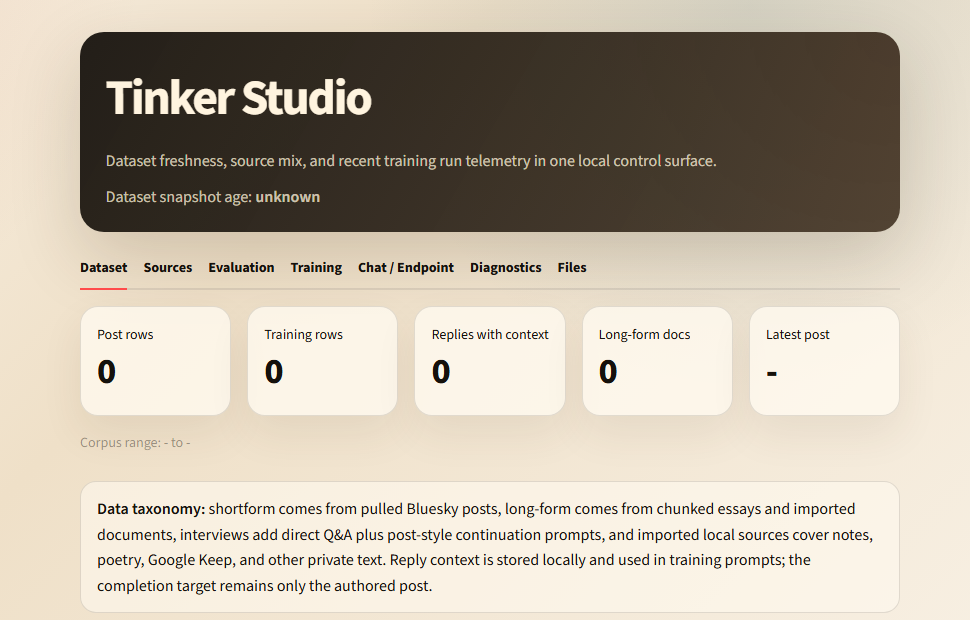

# Tinker Studio

Tinker Studio is a local workspace for turning personal writing into small
Tinker fine-tuning experiments. It keeps the private corpus under `data/`, gives
you a Streamlit dashboard for dataset and run health, and wraps the notebook,
training scripts, monitors, samplers, and import tools behind one launcher.



The screenshot above is the public-safe empty dataset state. Once your local
dataset is present, the dashboard fills in post counts, source mix, recent run
telemetry, and local checkpoint details.

## What Goes In

The training corpus is built from a few source types that are handled
differently on purpose.

**Pulled Bluesky posts**

The main short-form corpus comes from a Bluesky export/pull. The processed rows
land under the private dataset folder, usually `data/training_data`, and
the dashboard expects files like `processed/posts.csv`,
`processed/posts.jsonl`, and `tinker/dataset_manifest.json`. Reply rows can
carry parent/root context into the prompt while keeping the completion target to
the authored post only.

**Chunked long-form text**

Essays and long documents are split into overlapping continuation examples
instead of being used as one giant sample. Markdown seed rows and imported
long-form rows can be written through the source importer. These examples are
mixed into essay-heavy variants such as `recent_posts_plus_essays`.

**Interview Q&A**

Interview rows are a way to add deliberate self-description and preference data
without pretending it came from public posts. `collect_interview_qa.py` writes a
raw row and a normalized processed row. Training can use both direct Q&A
examples and post-style continuation prompts derived from the answer text.

**Imported local sources**

The importer accepts notes, poetry, Google Keep exports, and generic long-form
text. It writes local-only rows to `processed/imported_sources.jsonl`.
Google Keep keeps labels and color metadata; poetry gets a poetry-specific
continuation prompt; notes and long-form use their own source prompts.

## Setup

Poetry is the canonical dependency manager for this workspace:

```powershell
poetry install
```

For plain pip environments, `requirements.txt` mirrors the runtime dependencies:

```powershell
python -m pip install -r requirements.txt
```

Copy `.env.example` to `.env` and put local settings there:

```text
TINKER_API_KEY=...
TINKER_STUDIO_DATASET_ROOT=data/training_data
TINKER_DATASET_ROOT=data/training_data
```

The launchers load the project-local `.env`, so you do not need to install
`TINKER_API_KEY` globally.

## Launching

On Windows, use the shared launcher:

```powershell
.\tinker.bat streamlit
.\tinker.bat notebook
.\tinker.bat experiment essay_recent_r16 --smoke-test
.\tinker.bat monitor
```

The old `launch_*.bat` files still work, but they are thin aliases for
`tinker.bat`.

On Unix-like shells, use the shims in `unix/`:

```sh
sh unix/launch_streamlit_dashboard.sh
sh unix/launch_tinker_experiment.sh essay_recent_r16 --smoke-test
sh unix/launch_tinker_monitor.sh
```

## Dashboard

The Streamlit dashboard is the quickest way to see whether the local workspace
is ready to train. It shows:

- dataset snapshot age and Bluesky post corpus health;
- post volume, engagement, reply-context coverage, and searchable post rows;
- long-form, imported source, and import previews;
- recent local training metadata and cooperative stop state;
- recent Tinker API runs when `TINKER_API_KEY` is available;
- local endpoint bridge controls for sampler checkpoints.

The sidebar can pull the latest Bluesky posts when the private dataset builder
is available at the dataset root.

## Common Workflows

List interview prompt rounds:

```powershell
.\tinker.bat interview-collect list-rounds
```

Append an interview row interactively:

```powershell
.\tinker.bat interview-collect append
```

Preview local note, poetry, or Google Keep imports from the dashboard Sources
tab, or run the importer directly:

```powershell
poetry run python tinker_source_imports.py --input C:\path\to\notes --dataset-root data\training_data --source-type auto --preview
```

Run a smoke-test experiment:

```powershell
.\tinker.bat experiment essay_recent_r16 --smoke-test
```

Watch recent runs:

```powershell
.\tinker.bat monitor
.\tinker.bat tinker-dashboard
```

## Experiment Mixes

The experiment manager currently builds these dataset variants:

- `initial_posts`: original chronological post-only split with held-out
  validation and test rows.
- `recent_posts_plus_essays`: initial posts plus later Bluesky posts and
  chunked essay/markdown examples.
- `recent_posts_essays_interview`: the above plus a balanced interview-derived
  mix of direct Q&A and post-style continuation examples.
- `personal_sources_mix`: recent posts, essays, interview rows, and local
  imported sources such as notes or poetry.

Some blended variants disable post-train evaluation by default because later
posts can overlap the original validation/test horizon.

## Data Boundary

Private datasets, imports, run outputs, checkpoints, logs, local env files, and
Google Takeout folders are ignored by Git. The main public repo only keeps the
tooling and lightweight placeholders under `data/`.

Before publishing, keep real keys in `.env`, keep personal data under ignored
folders, and strip notebook outputs.

Codex skills are packaged in [codex_skills](codex_skills/README.md), including
dashboard, dataset planning, interview collection, training, monitoring, and
notebook recovery workflows.

Near-term product and corpus priorities are tracked in [ROADMAP.md](ROADMAP.md).
